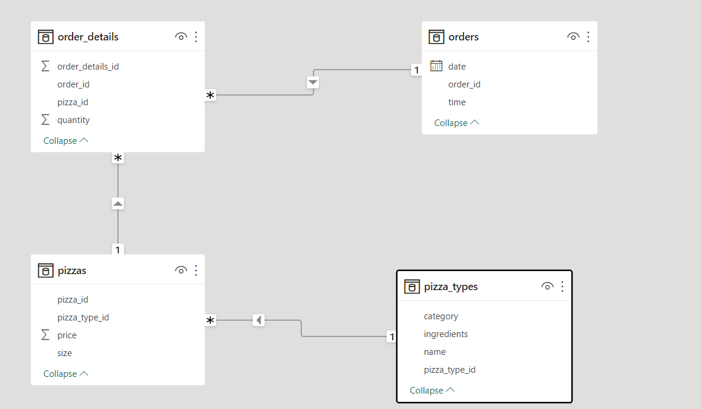
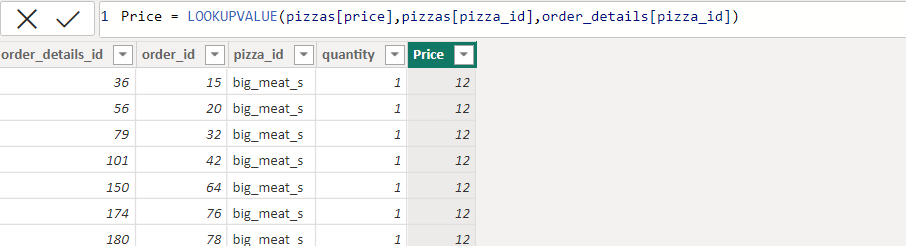
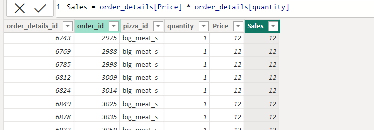
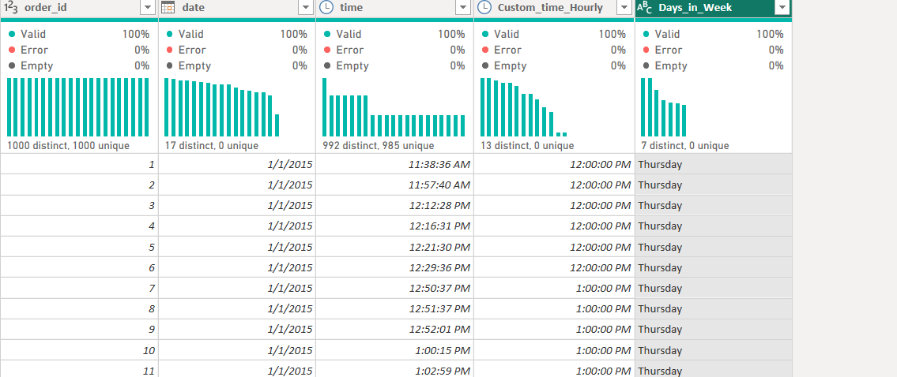
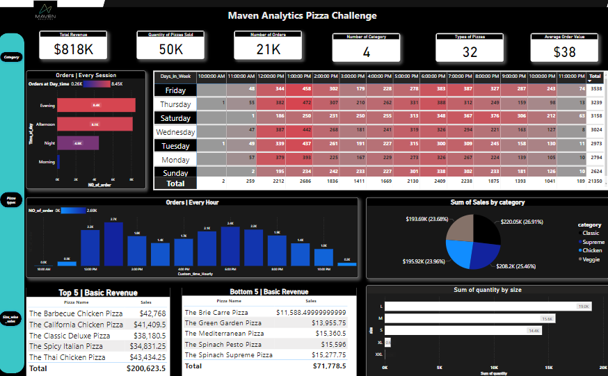
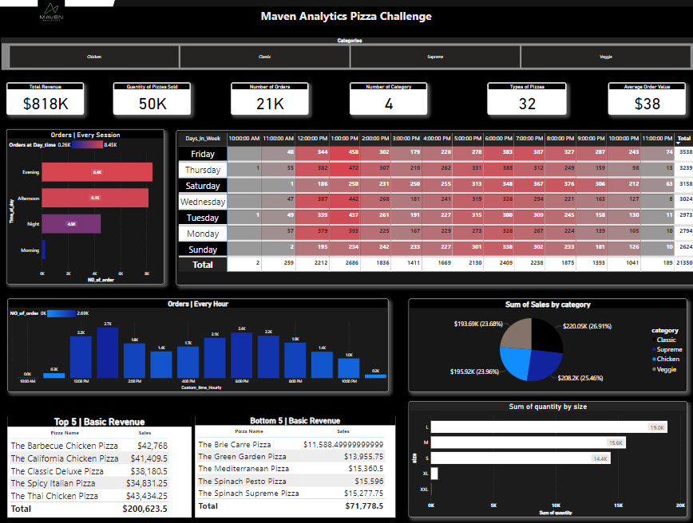
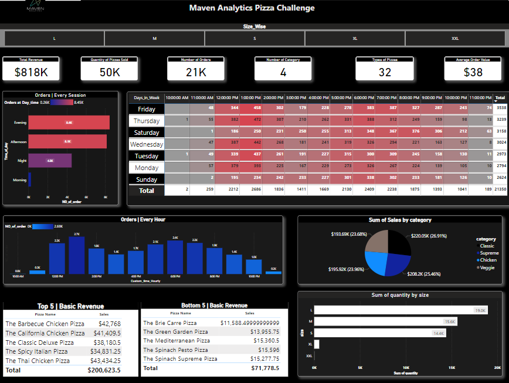
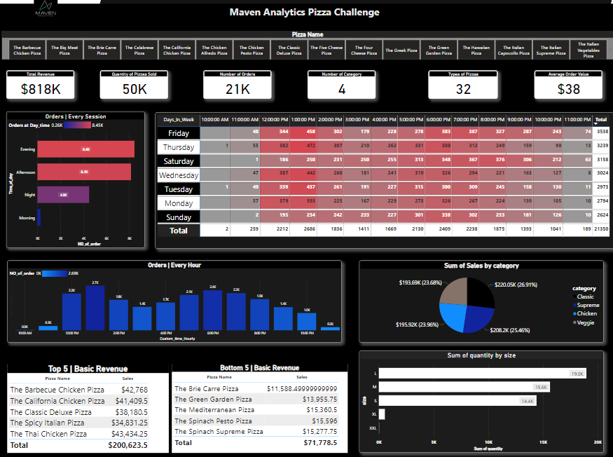

# Pizza Place Sales

A year's worth of sales from a fictitious pizza place, including the date and time of each order and the pizzas served, with additional details on the type, size, quantity, price, and ingredients.

## Project Flow Steps 

* 
<a href="#link1">Business Requirement Document & Data Gathering</a>

* 
<a href="#link2">Data Cleaning / Data Transformation</a>

* 
<a href="#link3">Data Modeling</a>

* 
<a href="#link4">DAX</a>

* 
<a href="#link5">UI</a>

# <h2 id="link1">Business Requirement Document and Data Gathering</h2>
 

__Data Defination__
 

 

__Problems we are trying to Solve and our main goal/objectves__

1. How many customers do we have each day? Are there any peak hours?

2. How many pizzas are typically in an order? Do we have any bestsellers?

3. How much money did we make this year? Can we indentify any seasonality in the sales?

4. Are there any pizzas we should take of the menu, or any promotions we could leverage?

 

# <h2 id="link3">Data Modeling</h2>  

I'm going to use __Star Schema__ as for data modeling in my data. 
__What is Star Schema ?__  
A star schema in Power BI is a type of data model where a central table, called the fact table, is connected to one or more dimension tables. The fact table contains the measures, or numeric data, and the dimension tables contain the attributes, or descriptive data, that are used to slice and dice the measures in the fact table.
For example, in a retail scenario, the fact table might be sales and the dimension tables might be products, customers, and time. The sales table would contain measures such as revenue, quantity sold, and profit, and the dimension tables would contain attributes such as product name, customer name, and date. This type of data model makes it easy to create powerful and flexible reports and analyses in Power BI by allowing users to easily drill down and filter the data based on the attributes in the dimension tables. 

 

# <h2 id="link4">DAX</h2>  

1. __DAX for Sales :__  
In __order_detail__ table , I want to calculate this __total sales__  through calculated column and for this , we have to fetch price column from __pizzas__ table and to do this , we use __lookupvalue function__.  
__Formula__ 
LOOKUPVALUE(
    <result_columnName>,
    <search_columnName>,
    <search_value>
    [, <search2_columnName>, <search2_value>]…
    [, <alternateResult>]
) 
 

 
 

2. __DAX for Total Order  :__  
Formula: NO_of_order = CALCULATE(DISTINCTCOUNT(orders[order_id]))  

3.  __DAX for converting_time to closest time :__  

Our goal to make this DAX to find the busiest hours when customer are rush in our resturant to eat pizza.So , we make DAX measure to find the closest hours from time column in order table and the picture of the DAX is as follow :
 

4. __DAX for finding Days wise Sale of Pizza in Week :__  

In this DAX , we use date column of order table and duplicate the date column , then goes to transform and goes to  days and then goes to name of days options. 

 

5. __DAX for finding Average order value :__  
Formula:  
Avg_order_value = DIVIDE(CALCULATE(SUM(order_details[Sales])),order_details[NO_of_order],0) 

6. __Making conditional Column to find different  :__  
Formula:  
Avg_order_value = DIVIDE(CALCULATE(SUM(order_details[Sales])),order_details[NO_of_order],0)
 

# <h2 id="link5">GUI</h2>  

Here's some snapshot of my dashboard :  

 
 
 
 

If you want to see my __Visuals and its working in detail__ . So , Kindly  visit to my __Pizza_Sales_Dashboard.pbix__ 
 

### AUTHOR

<strong>Shehryar Gondal</strong>

You can get in touch with me on my LinkedIn Profile: 
 

You can also follow my GitHub Profile to stay updated about my latest projects: 

If you liked the repo then kindly support it by giving it a star ⭐.

